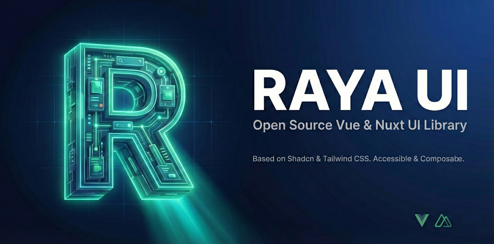

<div align="center">
  <a href="https://raya-ui.com">
    
  </a>

  <h1 align="center">Raya UI</h1>

  <p align="center">
    <strong>Beautifully designed components built with Vue & Shadcn.</strong>
  </p>

  <p align="center">
    <a href="https://github.com/iman-mohamadi/raya-ui/blob/main/LICENSE">
      
    </a>
    <a href="https://vuejs.org/">
      
    </a>
    <a href="https://nuxt.com/">
      
    </a>
  </p>
</div>

<br/>

<div align="center">
  
</div>

<br/>

## 📖 Introduction

**Raya** is not a component library. It's a collection of re-usable components that you can copy and paste into your apps.

It is built on top of [Tailwind CSS](https://tailwindcss.com) and [Radix Vue (Reka UI)](https://www.radix-vue.com/), providing accessible, customizable, and production-ready components for the modern Vue ecosystem.

## 🚀 Features

- **Copy-Paste:** No heavy dependencies or black-box npm packages. You own the code.
- **Accessible:** Built on top of `reka-ui` (formerly radix-vue) for full accessibility.
- **Themable:** Designed to work seamlessly with Tailwind CSS and Shadcn's design tokens.
- **Vue 3 & Nuxt Ready:** Optimized for the modern Vue ecosystem.
- **Animations:** Includes complex animations like Marquees, Scroll Spies, and 3D effects powered by CSS and Vue transitions.

## 📦 Installation

You can add components to your project using the `shadcn-vue` CLI or by manually copying the code.

### CLI (Recommended)

Use the CLI to automatically install a component and its dependencies.

```bash
npx shadcn-vue@latest add [https://raya-ui.com/registry/wheel-picker.json](https://raya-ui.com/registry/wheel-picker.json)