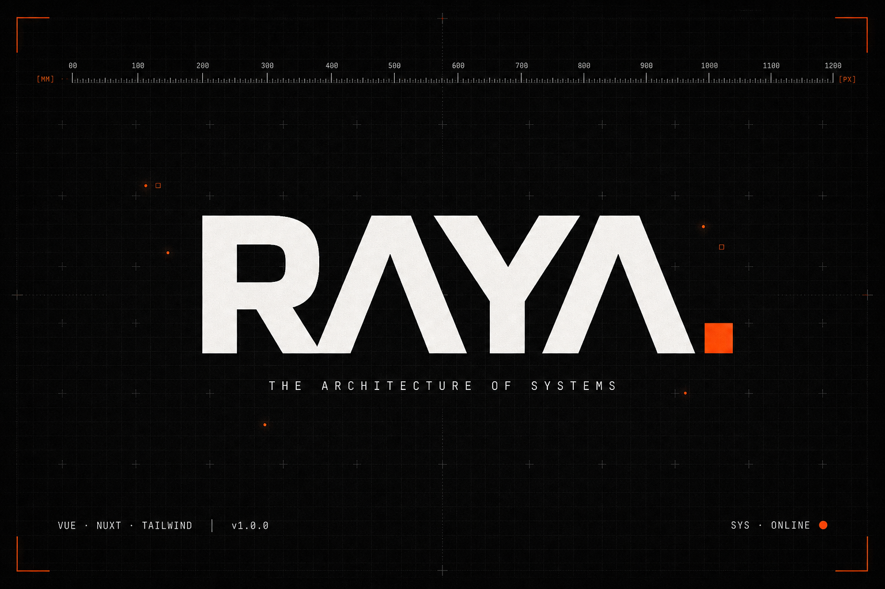

<div align="center">
  <a href="https://raya-ui.com">
    
  </a>

  <h1 align="center">Raya UI</h1>

  <p align="center">
    <strong>Beautifully engineered, high-end components built with Vue & Nuxt.</strong>
  </p>

  <p align="center">
    <a href="https://github.com/iman-mohamadi/raya-ui/blob/main/LICENSE">
      
    </a>
    <a href="https://vuejs.org/">
      
    </a>
    <a href="https://nuxt.com/">
      
    </a>
    <a href="https://tailwindcss.com/">
      
    </a>
  </p>
</div>

<br/>

<div align="center">
  
</div>

<br/>

## 📖 Introduction

**Raya UI** is not a traditional component library. It's a highly curated collection of re-usable, production-ready components designed for modern web engineers. You do not install it as a dependency; you copy and paste the code directly into your architecture.

Built on top of **[Shadcn Vue](https://www.shadcn-vue.com/)** (powered by **[Reka UI](https://reka-ui.com/)**) and Tailwind CSS, Raya UI delivers uncompromising accessibility, deep customization, and a premium aesthetic perfect for bento grid layouts, glassmorphism, and complex interactive dashboards.

## ⚡ Quick Start

Use the CLI to add components directly into your Nuxt or Vue project without bloating your `node_modules`.

```bash
npx shadcn-vue@latest add https://raya-ui.com/registry/pixelated-button.json
```

Import and use it immediately with full TypeScript support:

```vue
<script setup lang="ts">
import { PixelatedButton } from '@/components/ui/pixelated-button'
</script>

<template>
  <PixelatedButton>Initialize Engine</PixelatedButton>
</template>
```

## 🚀 Features

- **Copy-Paste Architecture:** No heavy dependencies or black-box npm packages. You own the component code entirely.
- **WAI-ARIA Compliant:** Leverages **Reka UI** primitives for guaranteed accessibility, screen-reader support, and keyboard navigation.
- **Modern Aesthetic:** Built-in support for complex UI patterns like Liquid Glass, Ambient Grids, and Magnetic interactions.
- **Vue 3.5 & Nuxt 4 Optimized:** Written from the ground up for the latest Vue ecosystem features and macros.
- **Tailwind Native:** Effortlessly themable using standard utility classes and design tokens.

## 📂 Architecture Overview

When you add a component via the CLI, Raya UI places it systematically into your project tree, ensuring your codebase remains pristine and modular.

```text
your-project/
├── app/
│   └── components/
│       └── ui/
│           ├── pixelated-button/
│           │   ├── PixelatedButton.vue
│           │   └── index.ts
│           └── liquid-glass/
│               ├── LiquidGlass.vue
│               └── index.ts
├── utils/
│   └── cn.ts
└── tailwind.config.ts
```

## 🔗 Links

- **[Documentation & Components](https://raya-ui.com)**
- **[Installation Guide](https://raya-ui.com/docs/installation)**
- **[GitHub Repository](https://github.com/iman-mohamadi/raya-ui)**

## 📄 License

This project is licensed under the MIT License - see the [LICENSE](LICENSE) file for details.